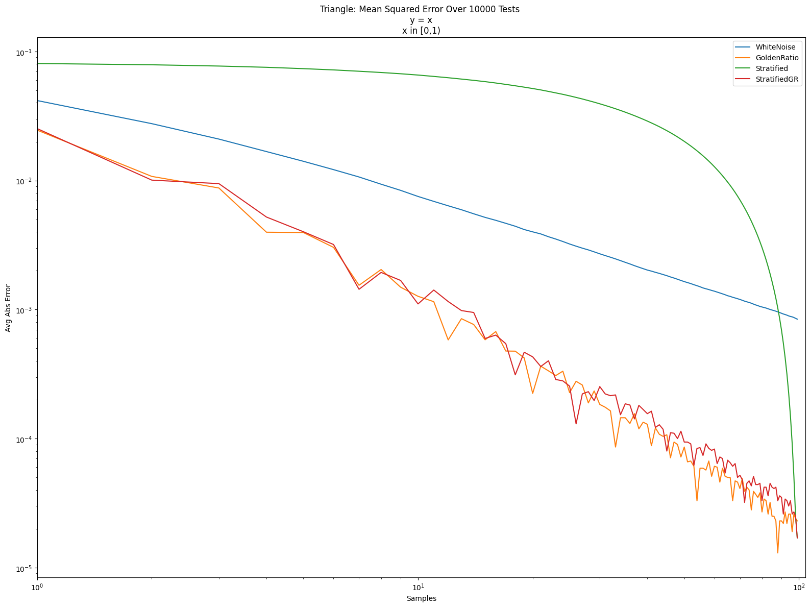

Code to go with a blog post about making stratified sampling progressive, using a low discrepancy shuffle iterator
https://blog.demofox.org/2025/08/03/toroidally-progressive-stratified-sampling-in-1d/

